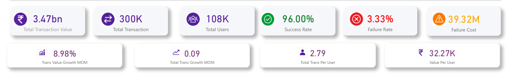
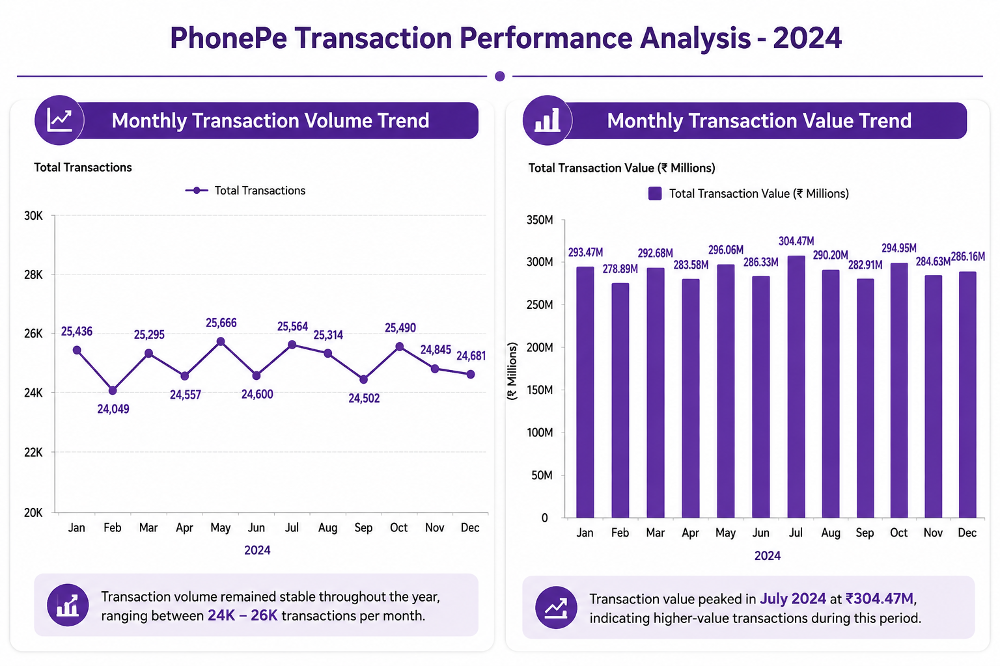
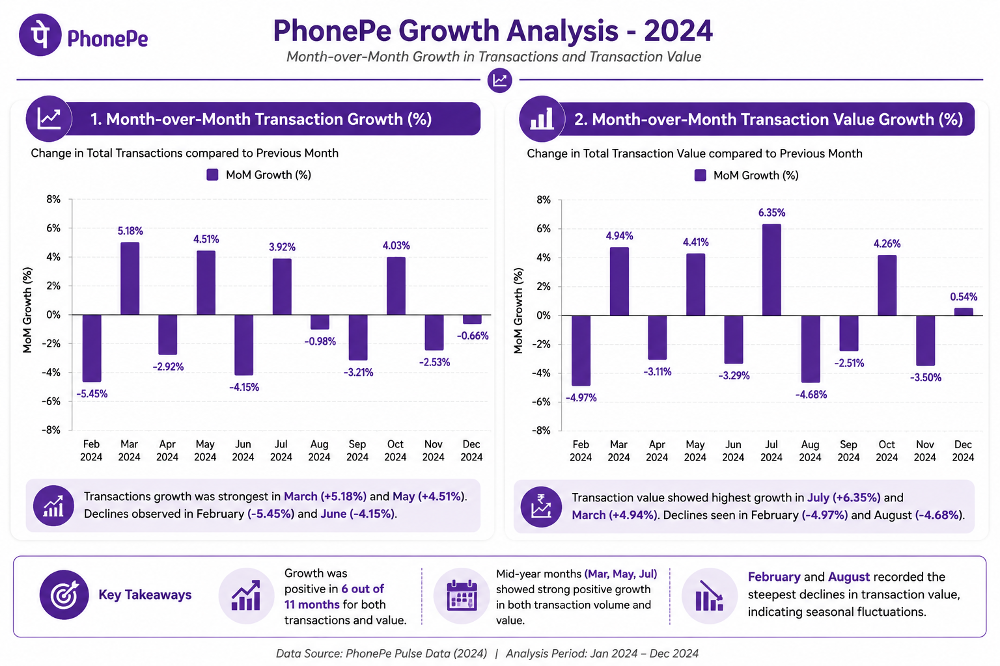
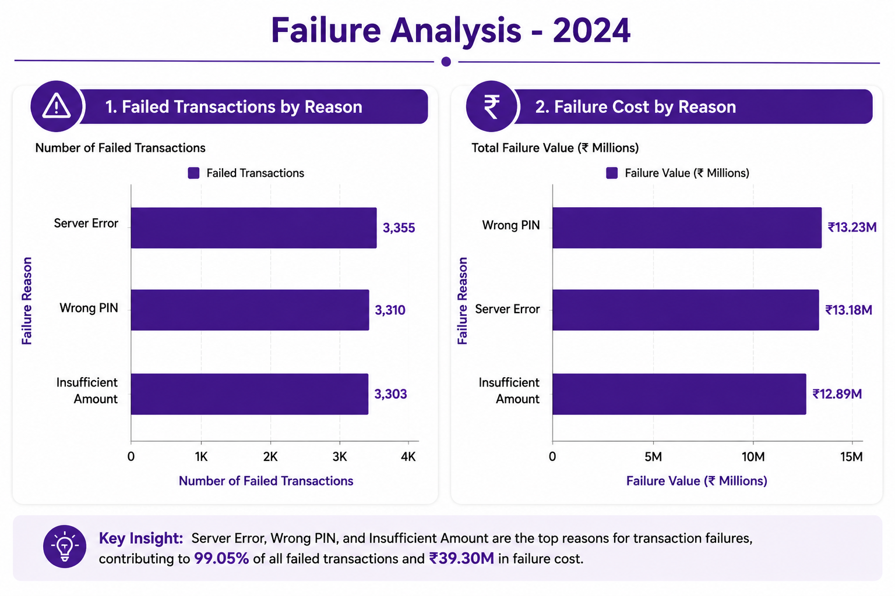
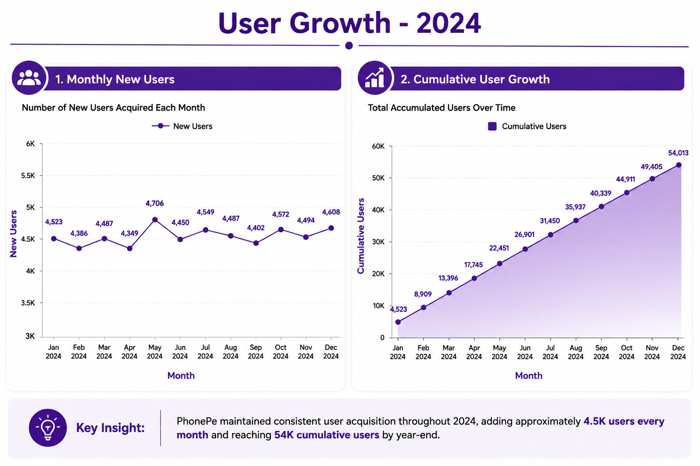

# 📊 PhonePe Transaction Analytics Dashboard

## Power BI | PostgreSQL | SQL | Data Analysis


## 📌 Project Overview

This project analyzes PhonePe transaction data for 2024 to understand transaction performance, customer activity, service contribution, and operational efficiency.

The project follows an end-to-end data analytics workflow:

- Data extraction using SQL
- KPI development
- Transaction trend analysis
- Growth analysis using SQL Window Functions
- Service performance analysis
- Failure analysis
- Interactive dashboard development using Power BI


---

# 🎯 Business Problem

Digital payment platforms generate millions of transactions every day. Understanding transaction behavior, customer engagement, service performance, and operational failures is essential for improving business decisions.

This analysis aims to answer:

- How is transaction performance changing over time?
- Which services contribute the highest transaction value?
- What factors cause transaction failures?
- How is the customer base growing?
- What improvements can increase operational efficiency?


---

# 📂 Dataset Description

The analysis uses two primary datasets:

## Transactions Dataset

Contains transaction-level information:

- Transaction ID
- User ID
- Amount
- Service
- Service Type
- Payment Status
- Failure Reason
- Transaction Date


## Users Dataset

Contains customer information:

- User ID
- Name
- Age
- Join Date


---

# 🛠 Tools & Technologies

| Tool | Purpose |
|-|-|
| PostgreSQL | Database management and SQL analysis |
| SQL | Data extraction and analytical queries |
| Window Functions | Growth calculations using LAG() |
| Power BI | Interactive dashboard development |
| DAX | Analytical measures |
| GitHub | Project documentation and version control |


---

# 🗄 Database Schema


## Transactions Table

| Column | Description |
|-|-|
| Transaction_ID | Unique transaction identifier |
| User_ID | Customer identifier |
| Amount | Transaction amount |
| Service | Service category |
| Payment_Status | Success or failure status |
| Reason | Failure reason |
| Date | Transaction date |


## Users Table

| Column | Description |
|-|-|
| User_ID | Unique user identifier |
| Name | Customer name |
| Age | Customer age |
| Join_Date | Registration date |


---

# 📊 Analysis Performed


## 1. KPI Analysis

Calculated important business metrics:

- Total Transaction Value
- Total Transactions
- Total Users
- Success Rate
- Failure Rate
- Failure Cost
- Average Transaction Value
- Transactions Per User
- Value Per User


---

## 2. Transaction Analysis

Performed:

- Monthly transaction volume analysis
- Monthly transaction value analysis


---

## 3. Growth Analysis

Implemented SQL Window Functions:

- LAG()
- Month-over-month growth calculation

Metrics analyzed:

- Transaction growth
- Transaction value growth


---

## 4. Service Analysis

Compared:

- Transaction volume by service
- Transaction value by service
- Average transaction value


---

## 5. Failure Analysis

Analyzed:

- Failure reasons
- Failure cost
- Service-level failure rates


---

## 6. User Growth Analysis

Analyzed:

- Monthly new users
- Cumulative user growth
- Month-over-month user growth


---

# 📈 Power BI Dashboard


## Dashboard Preview


The dashboard provides:

- Executive KPI summary
- Monthly transaction trends
- Growth analysis
- Service performance
- Failure analysis
- Customer growth insights


---

# ⭐ Key Business Insights


## Transaction Performance

- PhonePe processed approximately **300K transactions**.
- Total transaction value reached **₹3.47 Billion**.
- The platform maintained a **96% success rate**.


## Service Performance

- Money Transfer generated the highest transaction volume.
- Loans generated the highest transaction value (**₹2.53 Billion**).


## Failure Analysis

- Server Error was the highest failure category.
- Wrong PIN failures created the highest financial impact.


## Customer Growth

- More than **54K users** were acquired during the analysis period.
- User growth remained stable throughout the year.


---

# 📁 Project Structure


```
PhonePe_Transaction_Analysis

│
├── SQL
│   ├── Database_Setup
│   ├── KPI_Analysis
│   ├── Transaction_Analysis
│   ├── Growth_Analysis
│   ├── Service_Analysis
│   ├── Failure_Analysis
│   └── User_Growth_Analysis
│
├── PowerBI_Dashboard
│
├── Reports
│
└── README.md

```


---

# 🚀 How to Run This Project


1. Create PostgreSQL database.

2. Import datasets.

3. Execute SQL scripts in order.

4. Open Power BI dashboard file.

5. Refresh data connections.


---

# 🔮 Future Improvements

Future enhancements:

- Add customer segmentation analysis.
- Build predictive models for transaction failures.
- Analyze user retention patterns.
- Create automated reporting pipelines.


---

# 👤 Author

**Rana Mukherjee**

Data Analyst | SQL | Python | Power BI


⭐ If you find this project useful, consider giving it a star!
